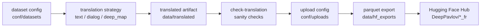

# DialogMTEB

## Многоязычное расширение диалогового embedding benchmark

<div class="mt-10 grid grid-cols-3 gap-4">
  <div class="stat-card">
    <div class="stat-value">25</div>
    <div class="stat-label">диалоговых датасетов в общем scope</div>
  </div>
  <div class="stat-card">
    <div class="stat-value">RU + FR</div>
    <div class="stat-label">языковые треки практической части</div>
  </div>
  <div class="stat-card">
    <div class="stat-value">open-source</div>
    <div class="stat-label">код, конфиги и публичные артефакты</div>
  </div>
</div>

<div class="mt-12 text-lg">
Кремнева Полина · Исаченко Богдан<br>
Руководитель: Леднева Дарья
</div>

<!--
Оба: короткое вступление. 20-25 секунд.
Сказать: мы расширяли DialogMTEB за пределы английского языка, фокус на русском и французском треках.
-->

---

# Почему это актуально

<div class="grid grid-cols-2 gap-6 mt-8">
  <div class="panel">
    <h3>Где используются embeddings</h3>
    <ul>
      <li>чат-боты и голосовые ассистенты</li>
      <li>поиск по диалогам поддержки</li>
      <li>retrieval-augmented dialogue systems</li>
      <li>классификация интентов и маршрутизация обращений</li>
    </ul>
  </div>
  <div class="panel accent">
    <h3>Пробел в оценке</h3>
    <ul>
      <li>общие benchmarks не всегда отражают диалоговую специфику</li>
      <li>в диалогах важны контекст, неполные реплики и прагматика</li>
      <li>многоязычное покрытие диалоговых задач остается ограниченным</li>
    </ul>
  </div>
</div>

<div class="source-line">
Опора: MTEB как общий benchmark embeddings; DialogMTEB как диалоговое расширение задач оценки.
</div>

<!--
Полина. 35-40 секунд.
Смысл: embeddings уже встроены в реальные продукты, но оценка моделей на диалогах и неанглийских языках хуже стандартизирована.
-->

---

# Исследовательская постановка

<div class="question-box mt-8">
Можно ли расширить DialogMTEB на новые языки через автоматический перевод так, чтобы сохранить валидность benchmark-задач?
</div>

<div class="grid grid-cols-2 gap-6 mt-8">
  <div>
    <h3>Гипотеза</h3>
    <p>
      Автоматический перевод + контроль качества позволяют получить пригодный
      многоязычный benchmark без ручной разметки каждого датасета с нуля.
    </p>
  </div>
  <div>
    <h3>Что должно сохраниться</h3>
    <ul>
      <li>схема датасета и split semantics</li>
      <li>labels, ids, qrels, action syntax</li>
      <li>сопоставимость evaluation protocol</li>
      <li>воспроизводимость pipeline</li>
    </ul>
  </div>
</div>

<!--
Богдан. 35-40 секунд.
Главная мысль: переводим не просто текст, а benchmark artifact, где нельзя ломать структуру задач.
-->

---

# Масштаб данных

<div class="coverage-grid mt-4">
  <div class="coverage-block">
    <h3>Intent / classification</h3>
    <p>atis_intents · banking77 · vira-intent · CLINC150 · HWU64 · MTOPIntent · MASSIVE</p>
  </div>
  <div class="coverage-block">
    <h3>Task-oriented dialogue</h3>
    <p>X-RiSAWOZ · Multi2WOZ · air-dialogue · FaithDial · DailyDialog</p>
  </div>
  <div class="coverage-block">
    <h3>Conversational retrieval</h3>
    <p>statcan-dialogue-dataset-retrieval · WebLINX · CANARD · MANtIS · WoW · QReCC · TREC iKAT 2023 · Coral</p>
  </div>
  <div class="coverage-block">
    <h3>QA / summarization</h3>
    <p>ClarQA · TopiOCQA · Abg-CoQA · DialogSum</p>
  </div>
</div>

<div class="mt-8 callout">
Общий scope команды: 25 датасетов разных типов диалоговых задач. В защите фокусируемся на том, как переводы делались воспроизводимо и проверяемо.
</div>

<!--
Богдан. 30-35 секунд.
Не читать все названия подряд. Показать масштаб и разнообразие: интенты, retrieval, QA, task-oriented, summarization.
-->

---

# Команда и распределение задач

<table class="team-table mt-4">
  <thead>
    <tr>
      <th>Участник</th>
      <th>Участие</th>
      <th>Зона ответственности</th>
      <th>Что показывает на защите</th>
    </tr>
  </thead>
  <tbody>
    <tr>
      <td><b>Кремнева Полина</b></td>
      <td>50%</td>
      <td>русскоязычный трек, notebook-based перевод, Yandex Translator, LLM-as-a-judge</td>
      <td>мотивация, русские переводы, LLM-оценка качества</td>
    </tr>
    <tr>
      <td><b>Исаченко Богдан</b></td>
      <td>50%</td>
      <td>французский трек, CLI/pipeline, конфиги, validation, parquet export, загрузка в Hugging Face</td>
      <td>pipeline, проверки, ошибки, артефакты и воспроизводимость</td>
    </tr>
  </tbody>
</table>

<div class="mt-6 source-line">
Руководитель: Леднева Дарья - постановка задачи, методологические консультации, рецензирование результатов.
</div>

<!--
Полина + Богдан. 35-40 секунд.
Это обязательный слайд по требованиям Talent Track. Четко проговорить разделение и кто за что отвечает.
-->

---

# Подход Полины: Russian track

<div class="grid grid-cols-2 gap-6 mt-6">
  <div class="panel">
    <h3>Артефакты</h3>
    <ul>
      <li><a href="https://github.com/interpparietes/DialogMTEB">interpparietes/DialogMTEB</a></li>
      <li><code>translator_yandex_*.ipynb</code></li>
      <li><code>LLM_Evaluation.ipynb</code></li>
      <li><code>DESCRIPTION.md</code> с описанием проекта</li>
    </ul>
  </div>
  <div class="panel accent">
    <h3>Ключевая идея</h3>
    <p>
      Для каждого датасета запускается перевод через Yandex Translator,
      затем LLM-as-a-judge оценивает качество перевода по нескольким критериям.
    </p>
  </div>
</div>

<div class="rubric-row mt-8">
  <div>Accuracy & completeness</div>
  <div>Grammar & orthography</div>
  <div>Naturalness & style</div>
</div>

<!--
Полина. 40-45 секунд.
Рассказывает про notebooks, Yandex Translator, LLM Evaluation и критерии оценки.
-->

---

# Подход Богдана: французский pipeline



<div class="grid grid-cols-3 gap-4 mt-6">
  <div class="mini-card"><b>воспроизводимость</b><br>один CLI для разных датасетов</div>
  <div class="mini-card"><b>учёт схемы</b><br>не ломаем labels, ids, qrels</div>
  <div class="mini-card"><b>готовность к загрузке</b><br>parquet layout для Hub</div>
</div>

<!--
Богдан. 45-50 секунд.
Главная мысль: это не набор разрозненных скриптов, а системный pipeline, который делает перевод повторяемым.
-->

---

# Контроль качества: что ловит pipeline

<div class="qa-grid mt-6">
  <div class="qa-item">split / row count mismatch</div>
  <div class="qa-item">пустые переводы</div>
  <div class="qa-item">разные длины списков</div>
  <div class="qa-item">непереведенный английский текст</div>
  <div class="qa-item">нарушение WebLINX action sequence</div>
  <div class="qa-item">misalignment строк на DailyDialog</div>
</div>

<div class="mt-8 callout">
Чтобы не плодить ложные warnings, checker игнорирует технические строки: URLs, filenames, attachments, paths, emails, hash/id-like values.
</div>

<!--
Богдан. 45-50 секунд.
Пояснить DailyDialog: найденный uploaded вариант был misaligned; локальный cleaned export прошел source-aware audit без ошибок.
-->

---

# Результаты и публичные артефакты

<table class="result-table mt-2">
  <thead>
    <tr>
      <th>French dataset</th>
      <th>Строк</th>
      <th>Статус</th>
    </tr>
  </thead>
  <tbody>
    <tr><td><a href="https://huggingface.co/datasets/DeepPavlov/air_dialog_fr">air_dialog_fr</a></td><td>402037</td><td>загружен</td></tr>
    <tr><td><a href="https://huggingface.co/datasets/DeepPavlov/daily_dialog_fr">daily_dialog_fr</a></td><td>102979</td><td>загружен</td></tr>
    <tr><td><a href="https://huggingface.co/datasets/DeepPavlov/canard_fr">canard_fr</a></td><td>77250</td><td>загружен</td></tr>
    <tr><td><a href="https://huggingface.co/datasets/DeepPavlov/multiwoz_fr">multiwoz_fr</a></td><td>71410</td><td>загружен</td></tr>
    <tr><td><a href="https://huggingface.co/datasets/DeepPavlov/clarqa_fr">clarqa_fr</a></td><td>34390</td><td>загружен</td></tr>
    <tr><td><a href="https://huggingface.co/datasets/DeepPavlov/weblinx_fr">weblinx_fr</a></td><td>19657</td><td>загружен</td></tr>
    <tr><td><a href="https://huggingface.co/datasets/DeepPavlov/statcan_dialog_fr">statcan_dialog_fr</a></td><td>11358</td><td>загружен</td></tr>
    <tr><td><a href="https://huggingface.co/datasets/DeepPavlov/faithdial_fr">faithdial_fr</a></td><td>3539</td><td>загружен*</td></tr>
  </tbody>
</table>

<div class="source-line mt-3">
Код: <a href="https://github.com/IsachenkoBogdan/data-translate">IsachenkoBogdan/data-translate</a>. В процессе: MANtIS, WoW, Abg-CoQA, Coral.
</div>

<!--
Полина начинает: общий open-source результат. Богдан продолжает: French repos и uploaded status. 45-50 секунд.
-->

---

# Ограничения и риски

<div class="risk-grid mt-8">
  <div class="risk-card">
    <h3>Семантика</h3>
    <p>Автоматический перевод может менять стиль, терминологию и прагматику диалога.</p>
  </div>
  <div class="risk-card">
    <h3>Структура задачи</h3>
    <p>Labels, ids, URLs, qrels и action syntax часто нужно сохранять, а не переводить.</p>
  </div>
  <div class="risk-card">
    <h3>Неполные артефакты</h3>
    <p>FaithDial загружен с <code>history_fr</code> и <code>knowledge_fr</code>; response/label поля требуют отдельного решения.</p>
  </div>
</div>

<!--
Богдан. 35-40 секунд.
Важно показать честность: у проекта есть ограничения, и pipeline специально проектировался вокруг рисков.
-->

---

# Масштабирование

<div class="timeline mt-8">
  <div>
    <b>Сейчас</b>
    <p>публичные RU/FR артефакты, проверяемый pipeline, первые HF uploads</p>
  </div>
  <div>
    <b>Следующий этап</b>
    <p>MANtIS, WoW, Abg-CoQA, Coral; human audit; LLM second-stage verification</p>
  </div>
  <div>
    <b>Дальше</b>
    <p>интеграция в multilingual DialogMTEB evaluation и расширение на другие языки</p>
  </div>
</div>

<!--
Богдан. 35-40 секунд.
Связать с критерием масштабирования: pipeline переносится на новые датасеты и языки, потому что формат задан конфигами и стратегиями.
-->

---

# Итог

<div class="final-box mt-10">
Мы не просто перевели датасеты, а подготовили воспроизводимую основу для многоязычной оценки диалоговых embedding-моделей.
</div>

<div class="grid grid-cols-3 gap-4 mt-10">
  <div class="mini-card"><b>Научная ценность</b><br>многоязычная проверка диалоговых embeddings</div>
  <div class="mini-card"><b>Инженерная ценность</b><br>pipeline, configs, checks, upload automation</div>
  <div class="mini-card"><b>Публичность</b><br>GitHub repos и Hugging Face datasets</div>
</div>

<!--
Оба. 25-30 секунд.
Закончить сильным one-liner и перейти к вопросам.
-->

---
layout: section
---

# Приложение

---

# Проверка по критериям практики

<table class="criteria-table">
  <tbody>
    <tr><td>Актуальность</td><td>диалоговые embeddings нужны для реальных ассистентов и поиска по разговорам</td></tr>
    <tr><td>Практическая значимость</td><td>публичные multilingual datasets и воспроизводимые scripts/configs</td></tr>
    <tr><td>Новизна</td><td>расширение DialogMTEB на RU/FR с контролем структуры задач</td></tr>
    <tr><td>Impact</td><td>8 French datasets уже загружены; Russian track покрыт notebooks и LLM evaluation</td></tr>
    <tr><td>R&D качество</td><td>CLI, tests, sanity checks, retries, configs, upload pipeline</td></tr>
    <tr><td>Масштабирование</td><td>новые datasets добавляются через configs и translation strategies</td></tr>
    <tr><td>Публичность</td><td>GitHub + Hugging Face Hub + оформленный README</td></tr>
  </tbody>
</table>

---

# Полезные ссылки

<div class="link-list mt-8">
  <div><b>Французский pipeline:</b> <a href="https://github.com/IsachenkoBogdan/data-translate">github.com/IsachenkoBogdan/data-translate</a></div>
  <div><b>Русскоязычный трек:</b> <a href="https://github.com/interpparietes/DialogMTEB">github.com/interpparietes/DialogMTEB</a></div>
  <div><b>Французские датасеты:</b> <a href="https://huggingface.co/DeepPavlov">huggingface.co/DeepPavlov</a></div>
  <div><b>MTEB:</b> Massive Text Embedding Benchmark</div>
  <div><b>DialogMTEB:</b> dialogue-specific benchmark direction for embedding evaluation</div>
</div>

---

# Команды воспроизведения

```bash
make translate DATASET=faithdial
make check-translation DATASET=faithdial
make upload-datasets UPLOAD=daily_dialog_fr
make upload-datasets-push UPLOAD=daily_dialog_fr
```

```bash
cd presentation
npm run build
npm run export
```

<div class="source-line mt-6">
Основная проверка: source schema -> translated artifact -> sanity checks -> parquet files -> Hugging Face dataset repo.
</div>
