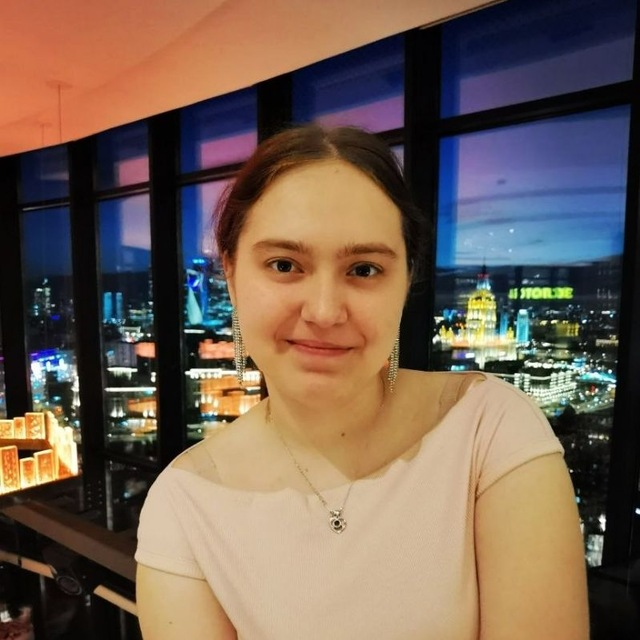
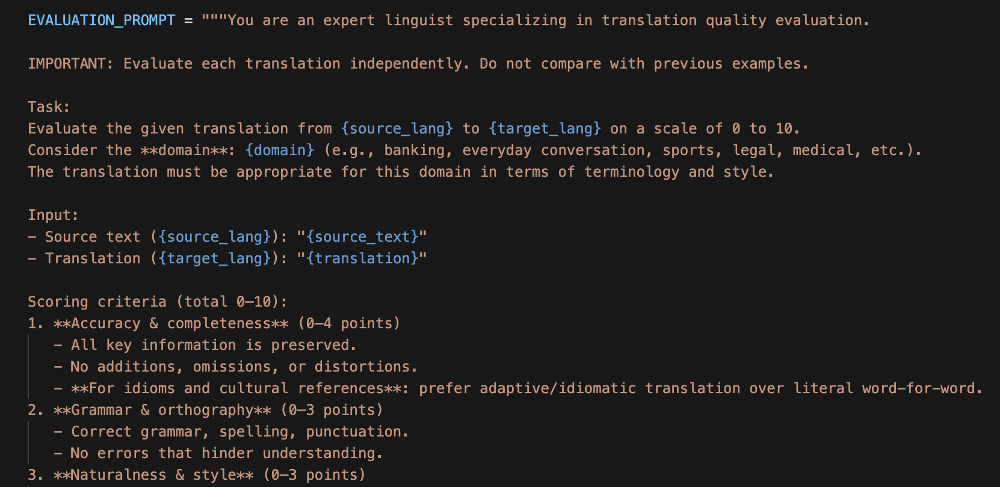
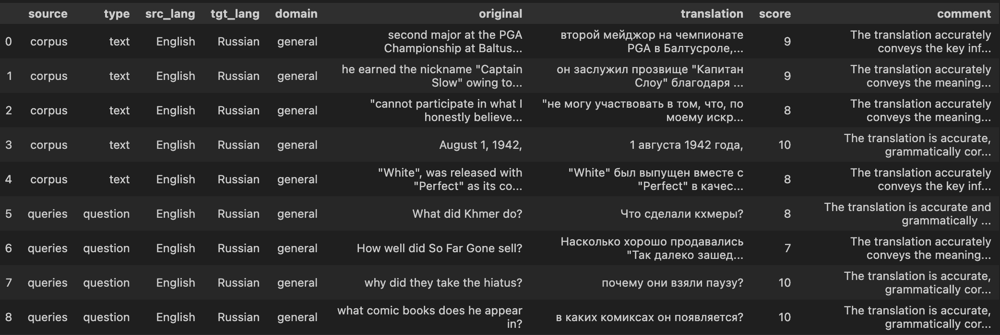

Семестровая практика · ИТМО · июнь 2026

# DialogMTEB

Расширение набора диалоговых задач для оценки моделей векторных представлений текста на русский и французский языки

  

    
24

    
набора данных и задач в командном объеме

  

  

    
RU + FR

    
два направления перевода

  

  

    
открыто

    
код, настройки, проверки и загруженные наборы данных

  

  <b>Кремнева Полина</b> · <b>Исаченко Богдан</b>
  Руководитель: <b>Леднева Дарья</b>

<!--
Оба. 20-25 секунд.
Сказать: мы расширяли DialogMTEB за пределы английского языка; Полина отвечала за русский перевод, Богдан - за французский перевод и инфраструктуру.
-->

---

Проблематика

# Оценка моделей в диалогах пока разрознена

  

    <h3>Где это используется</h3>
    <ul>
      <li>чат-боты и голосовые ассистенты</li>
      <li>поиск по истории обращений</li>
      <li>подбор и ранжирование ответов</li>
      <li>определение намерения пользователя</li>
    </ul>
  

  

    <h3>Чего не хватает</h3>
    <ul>
      <li>общие наборы оценки слабо отражают диалоговую специфику</li>
      <li>в диалогах важны история, кореференция и неполные реплики</li>
      <li>русский и французский языки покрыты хуже английского</li>
      <li>разные модели часто сравниваются на несопоставимых данных</li>
    </ul>
  

Нужен сопоставимый набор задач, который проверяет диалоговые модели на нескольких языках в одном протоколе.

<!--
Полина. 35-40 секунд.
Смысл: такие модели уже используются в продуктах, но диалоговая и многоязычная оценка хуже стандартизирована.
-->

---

Контекст проекта

# DialogMTEB покрывает 5 типов диалоговых задач

  

    
Нужно забронировать перелет в Лондон

    
Конечно, помогу подобрать рейс.

    

      Намерение
      <b>Бронирование перелета</b>
    

    
Пример: определить намерение по реплике с учетом диалогового контекста.

  

  

    
01<b>Классификация</b>
намерение, эмоция или другая метка реплики

    
02<b>Парная классификация</b>
совпадает ли смысл пары вопрос-ответ

    
03<b>Ранжирование</b>
упорядочить возможные ответы по релевантности

    
04<b>Поиск</b>
найти релевантный фрагмент диалога или документ

    
05<b>Смысловая близость</b>
оценить, насколько близки две реплики или два диалоговых фрагмента

  

Практическая задача команды: сохранить смысл задачи и структуру разметки при переводе, а не просто заменить английский текст.

<!--
Полина. 35-40 секунд.
Не читать все карточки. Сказать: типы задач разные, поэтому перевод должен учитывать структуру задачи.
-->

---

Постановка задачи

# Перевести набор задач, не нарушив его структуру

Можно ли расширить DialogMTEB на новые языки через автоматический перевод и контроль качества так, чтобы сохранить валидность задач?

  

    <h3>Гипотеза</h3>
    

      Автоматический перевод, оценка языковой моделью и статические проверки
      позволяют получить пригодный многоязычный набор задач без ручной разметки с нуля.
    

  

  

    <h3>Что нельзя сломать</h3>
    <ul>
      <li>разбиения на выборки и число строк</li>
      <li>метки, идентификаторы и связи релевантности</li>
      <li>списки реплик и вложенные диалоги</li>
      <li>ссылки, имена файлов и служебный синтаксис</li>
    </ul>
  

<!--
Богдан. 35-40 секунд.
Главная мысль: переводится не только текст, а весь проверяемый набор задач.
-->

---

Команда и роли

# Работу разделили по языкам и зонам ответственности

<table class="team-table mt-4">
  <thead>
	    <tr>
	      <th>Участник</th>
	      <th>Роль</th>
	      <th>Зона ответственности</th>
	      <th>Степень участия</th>
	    </tr>
	  </thead>
	  <tbody>
	    <tr>
	      <td><b>Кремнева Полина</b></td>
	      <td>исполнитель</td>
	      <td>перевод на русский; переводчик Yandex; оценка качества с помощью языковой модели</td>
	      <td>50% русское направление и проверка качества</td>
	    </tr>
	    <tr>
	      <td><b>Исаченко Богдан</b></td>
	      <td>исполнитель</td>
	      <td>перевод на французский; единая командная строка; настройки; проверки; выгрузка в Hugging Face</td>
	      <td>50% французское направление и инфраструктура</td>
	    </tr>
	    <tr>
	      <td><b>Леднева Дарья</b></td>
	      <td>руководитель проекта</td>
	      <td>научная постановка, методология DialogMTEB/MTEB, консультации и рецензирование результатов</td>
	      <td>методическое руководство</td>
	    </tr>
	  </tbody>
	</table>

  
Полина

  
Богдан

  
Дарья

<!--
Полина + Богдан. 35-40 секунд.
Это обязательный слайд Talent Track: роли, зоны ответственности и степень участия. Дарья указана как руководитель проекта, не как выступающий участник защиты.
-->

---

Масштаб данных

# В работе были разные типы диалоговых данных

  

    <h3>Намерения и классификация</h3>
    
atis_intents · banking77 · vira-intent · CLINC150 · HWU64 · MTOPIntent · MASSIVE

  

  

    <h3>Диалоговые сценарии</h3>
    
X-RiSAWOZ · Multi2WOZ · air-dialogue · FaithDial · DailyDialog

  

  

    <h3>Поиск в диалогах</h3>
    
statcan-dialogue-dataset-retrieval · WebLINX · CANARD · MANtIS · WoW · QReCC · TREC iKAT 2023 · Coral

  

  

    <h3>Вопросы-ответы и суммаризация</h3>
    
ClarQA · TopiOCQA · Abg-CoQA · DialogSum

  

  
<b>Командный пул:</b> 24 набора данных и задач в разных форматах DialogMTEB

  
<b>Публикация:</b> русские и французские переводы лежат в организации DeepPavlov

  
<b>Цель:</b> единый многоязычный протокол оценки

<!--
Богдан. 35 секунд.
Показать масштаб и разнообразие, не зачитывать полный список.
-->

---

Перевод на русский

# Цепочка перевода и оценки качества

  
<b>Исходный набор</b>тексты и разметка

  <i>-></i>
  
<b>Переводчик Yandex</b>пакетная обработка

  <i>-></i>
  
<b>Повторы запросов</b>устойчивость к сбоям

  <i>-></i>
  
<b>Оценка языковой моделью</b>качество перевода

  <i>-></i>
  
<b>Формат MTEB</b>готовность к оценке

  

    <b>Что переводилось</b>
    корпуса, вопросы, ответы, реплики и диалоговый контекст в разных типах задач DialogMTEB
  

  

    <b>Что сохранялось</b>
    идентификаторы, разбиения, связи релевантности и формат входа для последующей оценки
  

  

    <b>Как проверялось</b>
    повторы запросов, выборочная проверка и оценка языковой моделью по трем критериям
  

<!--
Полина. 45 секунд.
Рассказывает детали своей реализации сама; на слайде только общая цепочка и критерии качества.
-->

---

Проверка качества перевода

# Оценка языковой моделью: запрос и результат

  

    <h3>Запрос к модели</h3>
    
  

  

    <h3>Пример результата</h3>
    
  

  
<b>Вход</b>оригинал, перевод, язык и домен задачи

  
<b>Шкала</b>оценка от 0 до 10 для каждого примера

  
<b>Критерии</b>смысл, грамматика, естественность диалога

  
<b>Выход</b>балл и короткий комментарий о слабых местах

<!--
Полина. 40-45 секунд.
Акцент: качество проверялось отдельной процедурой, а не только фактом успешного перевода. Проверка не заменяет ручной аудит, но быстро показывает, где перевод теряет смысл, звучит неестественно или требует дополнительной двуязычной проверки.
-->

---

Перевод на французский

# Единый конвейер уменьшил ручные ошибки

  
описание набора <small>conf/datasets</small>

  <i>-></i>
  
стратегия перевода <small>текст · диалог · deep_map</small>

  <i>-></i>
  
переведенный результат <small>data/translated</small>

  <i>-></i>
  
check-translation <small>статические проверки</small>

  <i>-></i>
  
табличная выгрузка <small>data/hf_exports</small>

  <i>-></i>
  
Hugging Face <small>DeepPavlov/..._fr</small>

  

    <h3>Настройки</h3>
    
источник, поля, выборки и правила выгрузки описаны декларативно.

  

  

    <h3>Стратегии</h3>
    
простые поля, списки реплик и вложенные структуры переводятся по-разному.

  

  

    <h3>Автоматизация</h3>
    
одна команда закрывает перевод, проверку, экспорт и загрузку.

  

<!--
Богдан. 45-50 секунд.
Главная мысль: это не разрозненные скрипты, а воспроизводимый конвейер.
-->

---

Пример из работы · DailyDialog

# Статический анализатор нашел ошибку, которую легко пропустить глазами

  

    01
    <h3>Симптом</h3>
    
В одном из вариантов DailyDialog переведенные реплики не соответствовали исходным строкам.

  

  

    02
    <h3>Проверка</h3>
    
<code>check-translation</code> сравнил структуру, число строк, списки реплик и подозрительно неизмененные фрагменты.

  

  

    03
    <h3>Исправление</h3>
    
Мы пересобрали выгрузку из очищенного локального результата и убрали ложные предупреждения для ссылок, файлов и идентификаторов.

  

Практический эффект: перед загрузкой видно, где перевод действительно требует доработки, а где предупреждение является техническим шумом.

<!--
Богдан. 45 секунд.
Это реальный пример пользы статического анализатора: ошибка была не в красивости перевода, а в нарушении соответствия строк.
-->

---

Результаты и публикация

# Переводы на русский и французский лежат в DeepPavlov

  

    <b>Hugging Face · организация DeepPavlov</b>
    командные переводы публикуются в одном месте: русские и французские версии помечаются суффиксами _ru и _fr, код и настройки лежат в открытых репозиториях
  

  <a href="https://huggingface.co/DeepPavlov">huggingface.co/DeepPavlov</a>

  

    <h3>Намерения и классификация</h3>
    
atis_intents · banking77 · vira-intent · CLINC150 · HWU64 · MTOPIntent · MASSIVE

  

  

    <h3>Диалоговые сценарии</h3>
    
X-RiSAWOZ · DailyDialog · FaithDial · Multi2WOZ · air-dialogue

  

  

    <h3>Поиск и ранжирование</h3>
    
statcan-dialogue-dataset-retrieval · WebLINX · CANARD · MANtIS · WoW · QReCC · Coral · TREC iKAT 2023

  

  

    <h3>Вопросы-ответы и суммаризация</h3>
    
ClarQA · TopiOCQA · Abg-CoQA · DialogSum

  

<!--
Полина и Богдан. 50 секунд.
Сказать: это общий командный результат; русские и французские артефакты опубликованы в DeepPavlov, а не в личных репозиториях. Это важно как проверяемый артефакт проекта: результаты доступны не в локальных папках, а в общей организации вместе с кодом, настройками перевода и описанием статуса работ.
-->

---

Ограничения и дальнейшее развитие

# Риски понятны, следующий этап уже определен

  

    <h3>Ограничения</h3>
    <ul>
      <li>автоматический перевод может менять прагматику и стиль диалога</li>
      <li>служебные поля нельзя переводить как обычный текст</li>
      <li>не все поля одинаково важны для итоговой оценки моделей</li>
      <li>оценку языковой модели нужно калибровать на ручной проверке</li>
    </ul>
  

  

    <h3>Следующие шаги</h3>
    <ul>
      <li>дозавершить оставшиеся языковые версии MANtIS, WoW, Abg-CoQA и Coral</li>
      <li>добавить ручную двуязычную проверку на небольшой выборке</li>
      <li>запустить многоязычную оценку DialogMTEB</li>
      <li>расширить конвейер на новые языки</li>
    </ul>
  

Мы не просто перевели наборы данных: мы подготовили воспроизводимую основу для многоязычной оценки диалоговых моделей.

<!--
Оба. 35-40 секунд.
Закончить сильным выводом и перейти к вопросам.
-->
