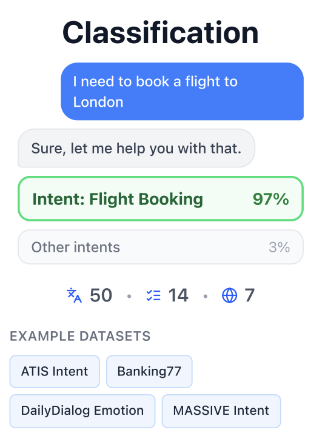
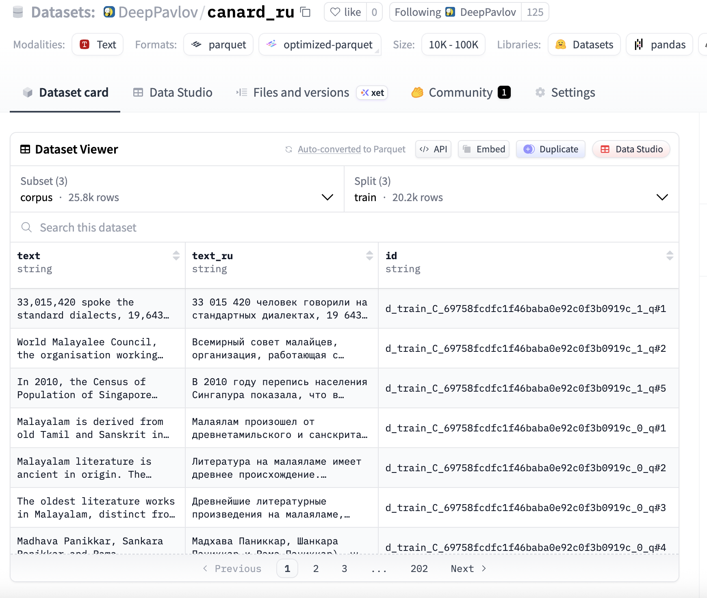

<div class="kicker">Семестровая практика · ИТМО · июнь 2026</div>

# DialogMTEB

<p class="hero-subtitle">
Расширение диалогового benchmark для embedding-моделей на русский и французский языки
</p>

<div class="hero-stats">
  <div class="metric-card">
    <div class="metric-value">25</div>
    <div class="metric-label">DialogMTEB tasks в общем scope</div>
  </div>
  <div class="metric-card">
    <div class="metric-value">RU + FR</div>
    <div class="metric-label">два языковых трека практики</div>
  </div>
  <div class="metric-card">
    <div class="metric-value">open-source</div>
    <div class="metric-label">GitHub, configs, checks, HF datasets</div>
  </div>
</div>

<div class="meta-row">
  <span><b>Кремнева Полина</b> · <b>Исаченко Богдан</b></span>
  <span>Руководитель: <b>Леднева Дарья</b></span>
</div>

<!--
Оба. 20-25 секунд.
Открытие: мы расширяли DialogMTEB за пределы английского языка. Полина закрывала русский трек, Богдан - французский и инфраструктуру.
-->

---

<div class="kicker">Проблематика</div>

# Embeddings в диалогах: оценка пока фрагментирована

<div class="two-col mt-6">
  <div class="card">
    <h3>Где это используется</h3>
    <ul>
      <li>чат-боты и ассистенты</li>
      <li>поиск по истории поддержки</li>
      <li>retrieval и reranking ответов</li>
      <li>классификация интентов и маршрутизация</li>
    </ul>
  </div>
  <div class="card accent">
    <h3>Где возникает gap</h3>
    <ul>
      <li>MTEB шире, но не фокусируется на диалоговой специфике</li>
      <li>в диалогах важны история, кореференция и неполные реплики</li>
      <li>многоязычное покрытие диалоговых задач остается слабым</li>
      <li>разные модели сравниваются на несопоставимых данных</li>
    </ul>
  </div>
</div>

<div class="highlight mt-7">
Нужен сопоставимый benchmark, который проверяет диалоговые embedding-модели на нескольких языках в одном протоколе.
</div>

<!--
Полина. 35-40 секунд.
Смысл: embeddings уже используются в продуктах, но диалоговый и multilingual сценарий хуже стандартизирован.
-->

---

<div class="kicker">Контекст проекта</div>

# DialogMTEB покрывает 5 типов диалоговых задач

<div class="task-map-layout mt-4">
  <div class="task-preview">
    
    <p>пример: intent classification на диалоговой реплике</p>
  </div>
  <div class="task-type-grid">
    <div><span>01</span><b>Классификация</b><p>intent, emotion, class label</p></div>
    <div><span>02</span><b>Парная классификация</b><p>match / no match для пары реплик</p></div>
    <div><span>03</span><b>Ранжирование</b><p>релевантность кандидатов ответа</p></div>
    <div><span>04</span><b>Поиск</b><p>query -> dialogue passage / document</p></div>
    <div class="wide"><span>05</span><b>Semantic similarity</b><p>насколько близки две реплики или диалоговые фрагменты</p></div>
  </div>
</div>

<div class="footnote mt-4">
Практическая задача команды: сохранить эти task semantics при переводе, а не просто заменить английский текст на другой язык.
</div>

<!--
Полина. 35-40 секунд.
Не читать все карточки. Сказать: типы задач разные, поэтому перевод должен учитывать структуру задачи.
-->

---

<div class="kicker">Постановка задачи</div>

# Перевести benchmark, не разрушив benchmark

<div class="question-box mt-6">
Можно ли расширить DialogMTEB на новые языки через автоматический перевод и контроль качества так, чтобы сохранить валидность задач?
</div>

<div class="two-col mt-6">
  <div class="card">
    <h3>Гипотеза</h3>
    <p>
      Автоматический перевод с LLM-контролем и структурными sanity checks
      позволяет получить пригодный multilingual benchmark без ручной разметки с нуля.
    </p>
  </div>
  <div class="card">
    <h3>Что нельзя сломать</h3>
    <ul>
      <li>split'ы и число строк</li>
      <li>labels, ids, qrels</li>
      <li>диалоговые turns и списки реплик</li>
      <li>URLs, filenames, action syntax</li>
    </ul>
  </div>
</div>

<!--
Богдан. 35-40 секунд.
Главная мысль: переводится benchmark artifact, поэтому качество - это и язык, и сохранение схемы.
-->

---

<div class="kicker">Команда и роли</div>

# Распределение задач было 50/50 по языковым трекам

<table class="team-table mt-5">
  <thead>
    <tr>
      <th>Участник</th>
      <th>Доля</th>
      <th>Зона ответственности</th>
      <th>Что рассказывает на защите</th>
    </tr>
  </thead>
  <tbody>
    <tr>
      <td><b>Кремнева Полина</b></td>
      <td><span class="badge">50%</span></td>
      <td>Russian track: перевод EN -> RU, notebook-based workflow, Yandex Translator, LLM-as-a-judge</td>
      <td>мотивация, типы задач, RU-переводы, LLM-оценка</td>
    </tr>
    <tr>
      <td><b>Исаченко Богдан</b></td>
      <td><span class="badge">50%</span></td>
      <td>French track: CLI/pipeline, YAML configs, translation strategies, validation, parquet export, HF upload</td>
      <td>pipeline, проверки, ошибки, HF artifacts, воспроизводимость</td>
    </tr>
    <tr>
      <td><b>Леднева Дарья</b></td>
      <td>руководитель</td>
      <td>научная постановка, методология DialogMTEB/MTEB, рецензирование результатов</td>
      <td>методологический контекст проекта</td>
    </tr>
  </tbody>
</table>

<!--
Полина + Богдан. 35-40 секунд.
Это обязательный слайд Talent Track. Четко проговорить личный вклад и роли.
-->

---

<div class="kicker">Масштаб данных</div>

# Scope: 25 задач и 24 named dataset families

<div class="dataset-grid mt-5">
  <div class="dataset-card">
    <h3>Intent / classification</h3>
    <p>atis_intents · banking77 · vira-intent · CLINC150 · HWU64 · MTOPIntent · MASSIVE</p>
  </div>
  <div class="dataset-card">
    <h3>Task-oriented dialogue</h3>
    <p>X-RiSAWOZ · Multi2WOZ · air-dialogue · FaithDial · DailyDialog</p>
  </div>
  <div class="dataset-card">
    <h3>Conversational retrieval</h3>
    <p>statcan-dialogue-dataset-retrieval · WebLINX · CANARD · MANtIS · WoW · QReCC · TREC iKAT 2023 · Coral</p>
  </div>
  <div class="dataset-card">
    <h3>QA / summarization</h3>
    <p>ClarQA · TopiOCQA · Abg-CoQA · DialogSum</p>
  </div>
</div>

<div class="status-row mt-6">
  <div><b>RU:</b> notebook translation + LLM evaluation</div>
  <div><b>FR:</b> 8 datasets uploaded, 4 in progress</div>
  <div><b>Goal:</b> единый multilingual evaluation protocol</div>
</div>

<!--
Богдан. 35 секунд.
Показать масштаб и разнообразие, не зачитывать полный список.
-->

---

<div class="kicker">Подход Полины · Russian track</div>

# Быстрые notebook-пайплайны + LLM-оценка качества

<div class="two-col wide-left mt-5">
  <div class="card">
    <h3>Pipeline</h3>
    <div class="pipeline">
      <span>dataset</span><i>-></i><span>Yandex Translator</span><i>-></i><span>cache + retries</span><i>-></i><span>LLM judge</span><i>-></i><span>MTEB format</span>
    </div>
    <div class="rubric-row mt-6">
      <div>Accuracy & completeness</div>
      <div>Grammar & orthography</div>
      <div>Naturalness & style</div>
    </div>
    <div class="highlight compact mt-5">
      Ценность: быстро переводить отдельные датасеты, проверять качество и готовить RU artifacts для оценки моделей.
    </div>
  </div>
  <div class="image-card">
    
  </div>
</div>

<!--
Полина. 45 секунд.
Рассказывает про notebooks translator_yandex_*, Yandex Translator, LLM_Evaluation.ipynb и критерии.
-->

---

<div class="kicker">Контроль качества · LLM-as-a-judge</div>

# LLM проверяет смысл, грамматику и естественность перевода

<div class="two-col wide-right mt-5">
  <div class="card">
    <h3>Что оценивается</h3>
    <ul>
      <li>сохранен ли смысл исходной реплики</li>
      <li>нет ли добавлений, пропусков и искажений</li>
      <li>грамматически ли корректен перевод</li>
      <li>звучит ли реплика естественно для диалога</li>
    </ul>
    <div class="highlight compact mt-5">
      Выход: score 0-10 + текстовое объяснение, которое помогает находить слабые места перевода.
    </div>
  </div>
  <div class="image-card dark-image">
    
  </div>
</div>

<!--
Полина. 40-45 секунд.
Акцент: это не просто one-shot перевод; качество проверяется отдельной rubric-based процедурой.
-->

---

<div class="kicker">Подход Богдана · French track</div>

# Унифицированный CLI превращает перевод в воспроизводимый pipeline

<div class="pipeline-board mt-5">
  <div>dataset config<br><small>conf/datasets</small></div>
  <i>-></i>
  <div>translation strategy<br><small>text · dialog · deep_map</small></div>
  <i>-></i>
  <div>translated artifact<br><small>data/translated</small></div>
  <i>-></i>
  <div>check-translation<br><small>sanity checks</small></div>
  <i>-></i>
  <div>parquet export<br><small>data/hf_exports</small></div>
  <i>-></i>
  <div>Hugging Face Hub<br><small>DeepPavlov/*_fr</small></div>
</div>

<div class="three-col mt-7">
  <div class="card">
    <h3>Configs</h3>
    <p>dataset schema, source, fields, splits и upload layout описаны декларативно.</p>
  </div>
  <div class="card">
    <h3>Strategies</h3>
    <p>разные структуры переводятся разными стратегиями, включая вложенный `deep_map`.</p>
  </div>
  <div class="card">
    <h3>Automation</h3>
    <p>CLI закрывает перевод, проверку, parquet export и загрузку в HF org.</p>
  </div>
</div>

<!--
Богдан. 45-50 секунд.
Главная мысль: это не разрозненные скрипты, а системный pipeline, который можно повторять и расширять.
-->

---

<div class="kicker">Контроль качества · check-translation</div>

# Структурные проверки ловят ошибки, которые LLM может не заметить

<div class="qa-grid mt-5">
  <div>split / row count mismatch</div>
  <div>пустые переводы</div>
  <div>разные длины списков</div>
  <div>подозрительно неизмененный английский</div>
  <div>WebLINX action sequence drift</div>
  <div>DailyDialog row misalignment</div>
</div>

<div class="two-col mt-7">
  <div class="card accent">
    <h3>Важно для precision</h3>
    <p>Checker отдельно suppress'ит ложные warnings для URLs, filenames, paths, emails, attachments и hash/id-like values.</p>
  </div>
  <div class="card">
    <h3>Практический эффект</h3>
    <p>Перед загрузкой видно, где перевод реально требует ручной доработки, а где warning был техническим шумом.</p>
  </div>
</div>

<!--
Богдан. 45 секунд.
Упомянуть пример DailyDialog: uploaded вариант был подозрительным, source-aware audit помог отделить misalignment от нормальных technical values.
-->

---

<div class="kicker">Результаты и публичные артефакты</div>

# Переводы опубликованы как проверяемые open-source артефакты

<div class="results-layout mt-4">
  <table class="result-table">
    <thead>
      <tr>
        <th>French dataset</th>
        <th>Rows</th>
        <th>Status</th>
      </tr>
    </thead>
    <tbody>
      <tr><td><a href="https://huggingface.co/datasets/DeepPavlov/air_dialog_fr">air_dialog_fr</a></td><td>402037</td><td>uploaded</td></tr>
      <tr><td><a href="https://huggingface.co/datasets/DeepPavlov/daily_dialog_fr">daily_dialog_fr</a></td><td>102979</td><td>uploaded</td></tr>
      <tr><td><a href="https://huggingface.co/datasets/DeepPavlov/canard_fr">canard_fr</a></td><td>77250</td><td>uploaded</td></tr>
      <tr><td><a href="https://huggingface.co/datasets/DeepPavlov/multiwoz_fr">multiwoz_fr</a></td><td>71410</td><td>uploaded</td></tr>
      <tr><td><a href="https://huggingface.co/datasets/DeepPavlov/clarqa_fr">clarqa_fr</a></td><td>34390</td><td>uploaded</td></tr>
      <tr><td><a href="https://huggingface.co/datasets/DeepPavlov/weblinx_fr">weblinx_fr</a></td><td>19657</td><td>uploaded</td></tr>
      <tr><td><a href="https://huggingface.co/datasets/DeepPavlov/statcan_dialog_fr">statcan_dialog_fr</a></td><td>11358</td><td>uploaded</td></tr>
      <tr><td><a href="https://huggingface.co/datasets/DeepPavlov/faithdial_fr">faithdial_fr</a></td><td>3539</td><td>uploaded*</td></tr>
    </tbody>
  </table>
  <div class="artifact-stack">
    <div class="card">
      <h3>RU artifacts</h3>
      <p><a href="https://github.com/interpparietes/DialogMTEB">interpparietes/DialogMTEB</a><br>notebooks, Yandex translation, LLM evaluation</p>
    </div>
    <div class="card">
      <h3>FR artifacts</h3>
      <p><a href="https://github.com/IsachenkoBogdan/data-translate">IsachenkoBogdan/data-translate</a><br>CLI, configs, checks, upload automation</p>
    </div>
  </div>
</div>

<div class="footnote mt-3">
* FaithDial artifact сейчас содержит `history_fr` и `knowledge_fr`. In progress: MANtIS · WoW · Abg-CoQA · Coral.
</div>

<!--
Полина начинает с общего результата, Богдан продолжает по French uploads. 50 секунд.
-->

---

<div class="kicker">Ограничения и масштабирование</div>

# Риски понятны, поэтому pipeline проектировался вокруг проверок

<div class="two-col mt-5">
  <div class="card">
    <h3>Ограничения</h3>
    <ul>
      <li>автоматический перевод может менять прагматику и стиль диалога</li>
      <li>служебные поля нельзя переводить как обычный текст</li>
      <li>не все dataset fields одинаково важны для evaluation</li>
      <li>LLM judge требует калибровки на human audit</li>
    </ul>
  </div>
  <div class="card accent">
    <h3>Следующие шаги</h3>
    <ul>
      <li>дозавершить MANtIS, WoW, Abg-CoQA, Coral</li>
      <li>добавить in-domain bilingual human audit</li>
      <li>запустить multilingual DialogMTEB evaluation</li>
      <li>расширить pipeline на новые языки</li>
    </ul>
  </div>
</div>

<div class="final-box mt-7">
Мы не просто перевели датасеты: мы подготовили воспроизводимую основу для многоязычной оценки диалоговых embedding-моделей.
</div>

<!--
Оба. 35-40 секунд.
Завершение основного рассказа. После one-liner перейти к вопросам или приложению, если осталось время.
-->

---
layout: section
---

# Приложение

---

<div class="kicker">Проверка по критериям практики</div>

# Как презентация закрывает критерии

<table class="criteria-table mt-4">
  <tbody>
    <tr><td>Актуальность</td><td>dialogue embeddings нужны для ассистентов, retrieval и поиска по разговорам</td></tr>
    <tr><td>Практическая значимость</td><td>публичные multilingual datasets, scripts, configs и HF artifacts</td></tr>
    <tr><td>Новизна</td><td>расширение DialogMTEB на RU/FR с сохранением структуры задач</td></tr>
    <tr><td>Impact</td><td>RU notebooks + LLM evaluation; 8 French datasets уже загружены в DeepPavlov</td></tr>
    <tr><td>R&D качество</td><td>CLI, retries, cache, YAML configs, translation strategies, sanity checks</td></tr>
    <tr><td>Масштабирование</td><td>новые датасеты добавляются через configs и стратегии, а не через ручную перепись pipeline</td></tr>
    <tr><td>Публичность</td><td>GitHub repositories, Hugging Face datasets, README, project description, PDF deck</td></tr>
  </tbody>
</table>

---

<div class="kicker">Ссылки</div>

# Публичные артефакты

<div class="link-list mt-6">
  <div><b>French pipeline:</b> <a href="https://github.com/IsachenkoBogdan/data-translate">github.com/IsachenkoBogdan/data-translate</a></div>
  <div><b>Project description:</b> <a href="https://github.com/IsachenkoBogdan/data-translate/blob/main/PROJECT_DESCRIPTION.md">PROJECT_DESCRIPTION.md</a></div>
  <div><b>Russian track:</b> <a href="https://github.com/interpparietes/DialogMTEB">github.com/interpparietes/DialogMTEB</a></div>
  <div><b>French datasets:</b> <a href="https://huggingface.co/DeepPavlov">huggingface.co/DeepPavlov</a></div>
  <div><b>MTEB:</b> <a href="https://arxiv.org/abs/2210.07316">Massive Text Embedding Benchmark</a></div>
</div>

---

<div class="kicker">Воспроизводимость</div>

# Команды проверки и загрузки

```bash
make translate DATASET=faithdial
make check-translation DATASET=faithdial
make upload-datasets UPLOAD=daily_dialog_fr
make upload-datasets-push UPLOAD=daily_dialog_fr
```

```bash
cd presentation
npm run build
npm run export
```

<div class="highlight mt-6">
Основной invariant: source schema -> translated artifact -> sanity checks -> parquet export -> Hugging Face dataset repo.
</div>
